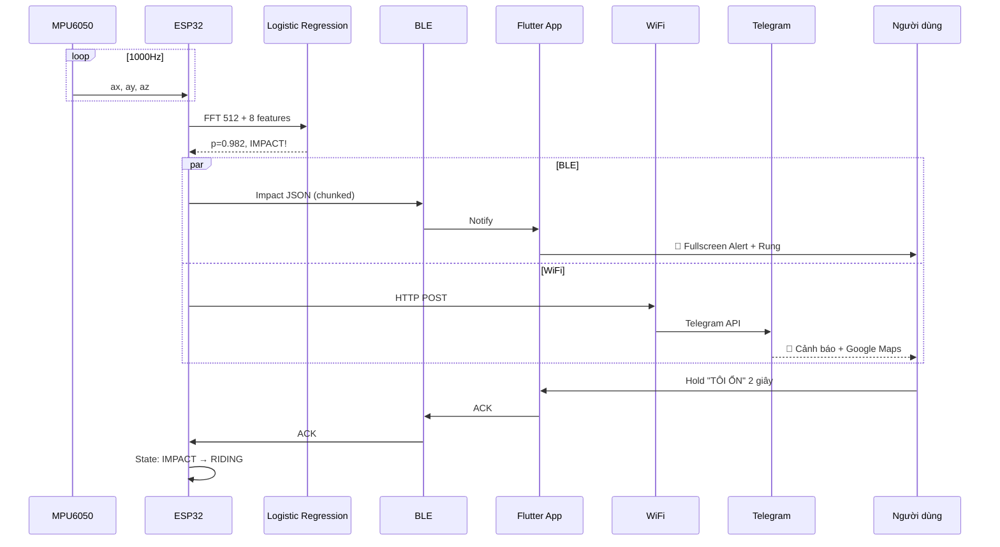

# 🪖 Hệ Thống Mũ Bảo Hiểm Thông Minh Ứng Dụng IoT & Machine Learning


## 📑 Mục lục

- [Giới thiệu](#-giới-thiệu)
- [Mục tiêu dự án](#-mục-tiêu-dự-án)
- [Kiến trúc hệ thống](#-kiến-trúc-tổng-thể-hệ-thống)
- [Phần cứng](#️-phần-cứng-sử-dụng)
- [Xử lý tín hiệu & ML](#-xử-lý-tín-hiệu--machine-learning)
- [Ứng dụng Flutter](#-ứng-dụng-di-động-flutter)
- [Backend & Dashboard](#-web-dashboard)
- [Cài đặt & chạy](#-hướng-dẫn-cài-đặt--chạy)
- [Giao thức JSON](#-giao-thức-json-telemetry)
- [Web Dashboard](#-web-dashboard)
- [Kết quả ML](#-ml-evaluation)
- [Kết quả đạt được](#-kết-quả-đạt-được)
- [Hạn chế](#️-hạn-chế)
- [Hướng phát triển](#-hướng-phát-triển-tương-lai)
- [Tác giả](#-tác-giả)

---

## ⚡ Quick Demo (3 phút)

```bash
# 1. Flash firmware lên ESP32
cd firmware_test && pio run -t upload

# 2. Chạy backend + Web Dashboard
cd backend && npm install && npm run dev

# 3. Mở Flutter app
cd smart_helmet_app && flutter run

# 4. Mở Web Dashboard
http://localhost:3000/dashboard
```

---

## 📖 Giới thiệu

Dự án **Hệ thống Mũ Bảo Hiểm Thông Minh** được xây dựng nhằm nâng cao an toàn cho người tham gia giao thông, đặc biệt là người đi xe máy - đối tượng chiếm tỷ lệ cao nhất trong các vụ tai nạn giao thông tại Việt Nam.

Hệ thống sử dụng **ESP32** làm trung tâm xử lý, tích hợp:

- **Cảm biến gia tốc MPU6050** thu thập dữ liệu chuyển động 1000 mẫu/giây
- **GPS NEO-6M** định vị tọa độ thời gian thực
- **Bluetooth BLE** kết nối không dây với smartphone (dual-phone + heartbeat)
- **WiFi + Telegram Bot** gửi cảnh báo khẩn cấp đến người thân
- **AI Impact Detection** + **Fall Detection** (Pitch/Roll/Gyro)
- **Ride Mode State Machine** chống false positive thông minh
- **GPS Cache + Multi-SSID WiFi** đảm bảo kết nối liên tục

Khi phát hiện **va chạm hoặc ngã xe**, hệ thống sẽ:

1. 🚨 Hiển thị màn hình cảnh báo trên App Flutter (rung + đếm ngược + hold TÔI ỔN)
2. 📍 Gửi tọa độ GPS (NEO-6M hoặc Phone fallback), tốc độ, xác suất va chạm qua BLE
3. 🔄 Retry liên tục 60s qua BLE + WiFi, lưu vào EEPROM buffer nếu mất kết nối
4. 📞 Tự động gọi điện khẩn cấp sau 15 giây nếu nạn nhân bất tỉnh
5. 🆘 Tự động gửi SOS sau 30 giây + broadcast BLE Mesh
6. ✈️ Gửi cảnh báo qua Telegram Bot kèm vị trí Google Maps
7. ✅ Cho phép người đội **giữ 2 giây** nút "TÔI ỔN" để hủy (chống chạm nhầm)

---

## 🎯 Mục tiêu dự án

### Phần cứng & Firmware

| STT | Mục tiêu                                                | Trạng thái   |
| --- | ------------------------------------------------------- | ------------ |
| 1   | Phát hiện va chạm bằng IMU + FFT + Logistic Regression  | ✅ F1=0.933  |
| 2   | Định vị GPS + gửi tọa độ tai nạn                        | ✅ Cache RTC |
| 3   | Phát hiện ngã xe (Fall Detection) bằng Pitch/Roll/Gyro  | ✅           |
| 4   | Ride Mode State Machine (IDLE/RIDING/IMPACT/FALLEN/SOS) | ✅           |
| 5   | GPS Cache + Multi-SSID WiFi Fallback                    | ✅           |
| 6   | On-device training trên ESP32                           | ✅           |

### Kết nối & Cảnh báo

| STT | Mục tiêu                                       | Trạng thái       |
| --- | ---------------------------------------------- | ---------------- |
| 7   | Dual-phone BLE + Heartbeat + Auto-reconnect    | ✅               |
| 8   | Impact Buffer (EEPROM) + Retry khi mất kết nối | ✅               |
| 9   | Telegram Bot + WiFi fallback cảnh báo          | ✅               |
| 10  | BLE Mesh Broadcast (cảnh báo lan tỏa)          | ✅ Đã triển khai |

### Mobile & Web

| STT | Mục tiêu                                            | Trạng thái   |
| --- | --------------------------------------------------- | ------------ |
| 11  | Flutter App: Dashboard + Alert + Settings + History | ✅           |
| 12  | Foreground Service + Wake Lock + GPS Fallback       | ✅           |
| 13  | Web Dashboard realtime (Leaflet + Socket.IO)        | ✅ Live demo |
| 14  | Backend lưu trữ MongoDB + Socket.IO                 | ✅           |

### Machine Learning

| STT | Mục tiêu                                                  | Trạng thái |
| --- | --------------------------------------------------------- | ---------- |
| 15  | ML Evaluation (Confusion Matrix, ROC, PR, Error Analysis) | ✅         |
| 16  | So sánh 3 model: Logistic Regression vs RF vs Threshold   | ✅         |

---

## 🧠 Kiến trúc tổng thể hệ thống

```mermaid
graph TD
    subgraph "Phần cứng - Mũ bảo hiểm"
        MPU["MPU6050\nGia tốc 3 trục"] -->|I2C| ESP["ESP32\nXử lý trung tâm"]
        GPS["GPS NEO-6M\nĐịnh vị"] -->|UART| ESP
    end

    subgraph "Xử lý trên ESP32"
        ESP -->|1000 Hz| FFT["FFT 512 điểm\n5 dải tần"]
        FFT -->|8 features| LR["Logistic Regression\nOn-device Training"]
        LR -->|p(impact)| DECISION{"Phát hiện\nva chạm?"}
    end

    subgraph "Cảnh báo"
        DECISION -->|BLE| APP["Flutter App\nHiển thị GPS + Alert"]
        DECISION -->|WiFi| TG["Telegram Bot\nGửi vị trí + ảnh"]
        APP -->|Nút bấm| SOS["SOS / TÔI ỔN"]
    end

    subgraph "Lưu trữ"
        APP -->|HTTP| BE["Backend Node.js\nExpress + MongoDB"]
    end
```

### Luồng phát hiện & cảnh báo va chạm



### Cấu trúc thư mục

```
He-Thong-Mu-Bao-Hiem-Thong-Minh/
├── firmware_test/          # Firmware ESP32 (PlatformIO, C++)
│   ├── src/
│   │   ├── main.cpp            # Vòng lặp chính: sampling + detection + stats
│   │   ├── imu.cpp/h           # Đọc MPU6050 qua I2C
│   │   ├── gps.cpp/h           # Parse NMEA GPS (GPRMC, GPGGA)
│   │   ├── ble.h               # API BLE (wrapper)
│   │   ├── ble_manager.cpp/h   # Dual-phone BLE + Heartbeat + Auto-reconnect
│   │   ├── ble.cpp             # Wrapper gọi ble_manager
│   │   ├── fft_features.cpp/h  # FFT 512 điểm, trích 5 dải tần
│   │   ├── ml_model.cpp/h      # Logistic Regression inference
│   │   ├── train_on_device.cpp/h  # Huấn luyện offline trên ESP32
│   │   ├── training_data.cpp/h # Dữ liệu huấn luyện có sẵn
│   │   ├── telegram.cpp/h      # WiFi + Telegram Bot API
│   │   ├── impact_buffer.cpp/h # EEPROM buffer + retry impact events
│   │   ├── wifi_manager.cpp/h  # Multi-SSID WiFi auto-connect
│   │   ├── ble_mesh.cpp/h      # BLE Mesh broadcast impact beacon
│   │   ├── fall_detector.cpp/h # Phát hiện ngã (Pitch/Roll/Gyro)
│   │   ├── ride_state.cpp/h    # State machine IDLE/RIDING/IMPACT/FALLEN/SOS
│   │   ├── gps_cache.cpp/h     # Cache GPS vị trí cuối (RTC memory)
│   │   ├── log_system.cpp/h    # Hệ thống log thống nhất (timestamp + level)
│   │   ├── logger.cpp/h        # Stream IMU raw qua BLE
│   │   ├── data_recorder.cpp/h # Ghi dữ liệu IMU để phân tích
│   │   └── config.h            # Cấu hình pin, tham số
│   ├── tools/
│   │   ├── evaluate_model.py   # ML Evaluation (ROC, PR, Confusion Matrix)
│   │   └── generate_impact_data.py
│   └── platformio.ini
│
├── smart_helmet_app/       # Ứng dụng di động Flutter
│   └── lib/
│       ├── main.dart               # Entry point + boot info + lifecycle
│       ├── services/
│       │   ├── ble_service.dart    # Kết nối BLE, buffer, parse JSON, auto-reconnect
│       │   ├── foreground_service.dart  # Foreground Service + Wake Lock
│       │   └── gps_fallback_service.dart # GPS fallback (NEO-6M / Phone)
│       ├── models/telemetry_data.dart   # Model GPS, Impact, IMU, State (v3)
│       ├── screens/
│       │   ├── home_screen.dart        # Dashboard: map + stats + ride card + nav
│       │   ├── impact_alert_screen.dart # 🚨 Fullscreen alert: hold TÔI ỔN 2s + ring
│       │   ├── settings_screen.dart    # ⚙️ Cài đặt: emergency contacts, GPS, theme
│       │   └── history_screen.dart     # 📜 Lịch sử: trips, alerts, stats
│       ├── utils/
│       │   └── app_logger.dart         # Log system: timestamp + levels + file export
│       └── widgets/
│           ├── gps_map.dart            # Bản đồ OpenStreetMap
│           ├── stats_grid.dart         # Grid cảm biến
│           ├── control_buttons.dart    # Nút TÔI ỔN, SOS, TEST
│           └── connection_status.dart  # Trạng thái kết nối
│
├── backend/                # Backend server (Node.js + Express + MongoDB)
│   ├── dashboard/              # 🌐 Web Dashboard (Leaflet + Socket.IO)
│   └── src/
│
├── data_logger/            # Công cụ thu thập & phân tích dữ liệu
│   ├── prep_and_train.py       # Tiền xử lý & huấn luyện ML
│   ├── analyze_fft.py          # Phân tích phổ FFT
│   ├── export_logit_to_c.py    # Xuất model sang C++ cho ESP32
│   └── *.csv                   # Dữ liệu thực nghiệm
│
├── simulator/              # Mô phỏng gửi telemetry lên backend
│   └── simulator.js
│
├── docs/
│   └── ml_evaluation/         # 📊 ML Evaluation (ROC, PR, Confusion Matrix)
│
├── TESTING.md              # 🧪 Test Plan (25+ test cases)
└── README.md
```

---

## ⚙️ Phần cứng sử dụng

| Linh kiện                   | Vai trò                                       | Giao tiếp                       |
| --------------------------- | --------------------------------------------- | ------------------------------- |
| **ESP32 Dev Module**        | Vi điều khiển trung tâm                       | -                               |
| **MPU6050 (GY-521)**        | Cảm biến gia tốc 3 trục + con quay hồi chuyển | I2C (SDA=21, SCL=22)            |
| **GPS NEO-6M (GY-NEO6MV2)** | Định vị vệ tinh GPS                           | UART2 (RX=16, TX=17, Baud=9600) |
| **Smartphone Android**      | Hiển thị, cảnh báo, gọi điện                  | BLE 4.0+                        |

---

## 📊 Xử lý tín hiệu & Machine Learning

### 🔹 Quy trình xử lý

```
IMU 1000Hz → |a| = √(ax²+ay²+az²) → Buffer 512 mẫu (~512ms)
    → FFT 512 điểm → 5 dải tần năng lượng
    → [F0, F1, F2, F3, F4, ax, ay, az] = 8 features
    → Logistic Regression → p(impact) ∈ [0, 1]
    → p > threshold AND peak_g > PEAK_G_MIN → VA CHẠM!
```

### 🔹 5 dải tần FFT

| Band | Tần số (Hz) | Ý nghĩa vật lý                       |
| ---- | ----------- | ------------------------------------ |
| 0    | 0.5 – 4     | Chuyển động nền (rung xe, đường xóc) |
| 1    | 4 – 8       | Rung động mạnh (ổ gà, phanh gấp)     |
| 2    | 12 – 20     | Bắt đầu va chạm (biến dạng mũ)       |
| 3    | 20 – 40     | Va đập chính (truyền xung lực)       |
| 4    | 40 – 80     | Xung lực tần số cao (nứt vỡ)         |

### 🔹 Mô hình Logistic Regression

- **Input**: 8 features (5 FFT + 3 accel raw)
- **Output**: Xác suất va chạm `p ∈ [0, 1]`
- **Training**: Gradient Descent offline trên ESP32 với dữ liệu thực tế
- **Ngưỡng phát hiện**:
  - Chế độ thường: `p > 0.97` AND `peak_g > 2.8g`
  - Chế độ test: `p > 0.25` AND `peak_g > 0.8g`

### 🔹 Cơ chế chống nhiễu

- **Peak G filter**: Chỉ xét nếu gia tốc đỉnh vượt ngưỡng
- **Confirm windows**: Cần 1-2 cửa sổ liên tiếp xác nhận
- **Debounce**: 5 giây giữa các lần cảnh báo

---

## 📱 Ứng dụng di động (Flutter)

### 🏠 Home Dashboard

- 🗺️ **Bản đồ GPS** real-time với OpenStreetMap + marker vị trí + polyline
- 📊 **Stats Grid**: Peak G, AI probability, Satellites, Speed
- 🏁 **Ride State Card**: IDLE / RIDING / IMPACT / FALLEN / SOS (màu + icon)
- 🎮 **Control Buttons**: TÔI ỔN, SOS, TEST VA CHẠM
- 🔔 **Navigation**: ⚙️ Settings, 📜 History (icon trên header)
- 📡 **Connection Status**: 🟢 Online / 🔴 Offline / 🚨 Impact
- 📁 **Foreground Service**: App chạy nền với notification + Wake Lock
- 📱 **GPS Fallback**: Auto chuyển NEO-6M → Phone GPS khi tín hiệu yếu

### 🚨 Impact Alert Screen (WOW factor)

- 🎯 **Fullscreen** — không có nút back
- 🔄 **Circular countdown ring** 30s → 0s, <15s chuyển đỏ khẩn cấp
- ✋ **Hold 2 giây** nút TÔI ỔN (có progress bar fill) — chống chạm nhầm khi bất tỉnh
- 📳 **Rung haptic liên tục** 800ms đến khi phản hồi
- 📞 **Tự động gọi** sau 15s, **tự động SOS** sau 30s
- 🛑 **Fall Detection**: hiển thị Pitch/Roll khi ngã xe
- 📍 **GPS info** + Google Maps link

### ⚙️ Settings Screen

- 📞 Liên hệ khẩn cấp (2 số điện thoại)
- 🚨 Cấu hình cảnh báo: auto-call, auto-SOS, âm lượng, rung
- 🛰️ GPS mode: Auto / NEO-6M Only / Phone GPS Only
- 🎨 Theme: Dark / Light, Ngôn ngữ: Việt / Anh
- ℹ️ About: version, tác giả

### 📜 History Screen (3 tabs)

- 🛣️ **Chuyến đi**: danh sách trip + detail bottom sheet (quãng đường, tốc độ)
- ⚠️ **Cảnh báo**: danh sách impact/fall events kèm vị trí + trạng thái
- 📊 **Thống kê**: tổng km, số chuyến, số cảnh báo, false alarm rate

### Giao thức BLE

- **Service**: Nordic UART (`6e400001-b5a3-f393-e0a9-e50e24dcca9e`)
- **TX (Notify)**: ESP32 → App, JSON 340-500 byte, chunk 180B + `\n`
- **RX (Write)**: App → ESP32, lệnh `START`/`STOP`/`ACK`/`SOS`/`TEST_IMPACT`
- **MTU**: Negotiate 512, fallback 185

---

## ✈️ Cảnh báo Telegram

Khi phát hiện va chạm hoặc ngã xe, ESP32 gửi tin nhắn qua Telegram Bot:

**Va chạm (Impact):**

```
🚨 CẢNH BÁO VA CHẠM!
👤 Mũ: H001
🕐 Thời gian: 2026-06-02 12:34:56
📍 Vị trí: 21.02845, 105.83591 (NEO-6M)
🗺️ Google Maps: https://maps.google.com/?q=21.02845,105.83591
⚡ Đỉnh gia tốc: 3.25g
🧠 AI xác suất: 98.5%
🏍️ Tốc độ: 45.2 km/h
🔋 Trạng thái: RIDING → IMPACT
```

**Ngã xe (Fall Detection):**

```
🛑 PHÁT HIỆN NGA XE!
👤 Mũ: H001
🕐 Thời gian: 2026-06-02 12:35:20
📍 Vị trí: 21.02845, 105.83591
🗺️ Google Maps: https://maps.google.com/?q=21.02845,105.83591
📐 Pitch: 72.3°, Roll: 15.1°
🔄 Vận tốc góc: 185°/s
⚡ Đỉnh gia tốc: 3.12g
🏍️ Tốc độ: 0 km/h (đã dừng)
🔋 Trạng thái: RIDING → FALLEN
⚠️ Có thể người đi xe đã ngã! Kiểm tra ngay!
```

---

## 🌐 Backend (Node.js)

- **Express** REST API + **Socket.io** realtime
- **MongoDB** lưu trữ dữ liệu telemetry
- **AJV** validate JSON schema
- Endpoints: `POST /api/telemetry`, WebSocket events

---

## 🔌 Sơ đồ đấu nối phần cứng

```
ESP32 Dev Module          MPU6050 (GY-521)
┌──────────────┐          ┌──────────────┐
│           GND├──────────┤GND           │
│           3V3├──────────┤VCC           │
│        SDA 21├──────────┤SDA           │
│        SCL 22├──────────┤SCL           │
└──────────────┘          └──────────────┘

ESP32 Dev Module          GPS NEO-6M (GY-NEO6MV2)
┌──────────────┐          ┌──────────────┐
│           GND├──────────┤GND           │
│           VIN├──────────┤VCC (3.3-5V)  │
│        RX 16├──────────┤TX            │
│        TX 17├──────────┤RX            │
└──────────────┘          └──────────────┘
```

---

## 🚀 Hướng dẫn cài đặt & chạy

### 1. Firmware ESP32

```bash
# Cài PlatformIO (VS Code Extension)
cd firmware_test/

# Sửa file src/secrets.h với WiFi + Telegram Bot Token
# #define WIFI_SSID "TenWiFi"
# #define WIFI_PASS "MatKhau"
# #define BOT_TOKEN "123456:ABC-DEF1234gh"
# #define CHAT_ID "123456789"

# Build & Upload
pio run --target upload

# Mở Serial Monitor xem log
pio device monitor
```

### 2. Ứng dụng Flutter

```bash
cd smart_helmet_app/

# Cài dependencies
flutter pub get

# Chạy trên máy ảo hoặc thiết bị thật
flutter run

# Build APK
flutter build apk --release
```

### 3. Backend

```bash
cd backend/

# Cài dependencies
npm install

# Sửa file .env
# MONGODB_URI=mongodb://localhost:27017/smarthelmet
# PORT=3000

# Chạy server
npm run dev
```

### 4. Data Logger (Python)

```bash
cd data_logger/

# Tạo virtual environment
python -m venv .venv
.venv\Scripts\activate   # Windows
source .venv/bin/activate # Linux/Mac

# Cài dependencies
pip install numpy pandas scipy matplotlib scikit-learn

# Huấn luyện mô hình
python prep_and_train.py

# Xuất model sang C++ cho ESP32
python export_logit_to_c.py
```

### 5. Simulator

```bash
cd simulator/
npm install
node simulator.js --helmet H001 --scenario random --interval 3000
```

---

## 📡 Giao thức JSON Telemetry

ESP32 gửi JSON qua BLE mỗi ~500ms (v3 schema — firmware v2.0.0):

```json
{
  "type": "telemetry",
  "schema_version": 3,
  "helmet_id": "H001",
  "device_type": "helmet",
  "gps": {
    "lat": 21.02845,
    "lon": 105.83591,
    "speed_kmh": 7.4,
    "satellites": 4,
    "hdop": 3.97,
    "source": "neo6m"
  },
  "imu": {
    "pitch_deg": -2.5,
    "roll_deg": 1.3,
    "angular_vel_dps": 15.8
  },
  "impact": {
    "detected": false,
    "ai_p": 0.023,
    "peak_g": 1.12,
    "confidence": 0.023,
    "event_type": "none"
  },
  "state": {
    "ride_state": "RIDING",
    "fall_detected": false,
    "uptime_s": 3600
  },
  "firmware": {
    "version": "2.0.0",
    "build": "esp32-fall-detect"
  }
}
```

### 🆕 V3 Schema — Tính năng mới

| Field                 | Mô tả                                                    |
| --------------------- | -------------------------------------------------------- |
| `gps.source`          | Nguồn GPS: `neo6m`, `cache`, `phone`                     |
| `imu.pitch_deg`       | Góc nghiêng trước-sau (độ)                               |
| `imu.roll_deg`        | Góc nghiêng trái-phải (độ)                               |
| `imu.angular_vel_dps` | Vận tốc góc tổng hợp (°/s)                               |
| `impact.event_type`   | Loại sự kiện: `none`, `impact_detected`, `fall_detected` |
| `state.ride_state`    | Trạng thái: `IDLE`, `RIDING`, `IMPACT`, `FALLEN`, `SOS`  |
| `state.fall_detected` | Đã phát hiện ngã xe chưa                                 |

---

### Lệnh điều khiển (App → ESP32)

| Lệnh          | Ý nghĩa                     |
| ------------- | --------------------------- |
| `START`       | Bắt đầu stream dữ liệu      |
| `STOP`        | Dừng stream                 |
| `ACK`         | Xác nhận an toàn            |
| `SOS`         | Yêu cầu cứu hộ khẩn cấp     |
| `TEST_IMPACT` | Giả lập va chạm để kiểm tra |

---

## 🌐 Web Dashboard

Truy cập `http://<backend-ip>:3000/dashboard`:

- 🗺️ **Bản đồ realtime** Leaflet + OpenStreetMap với marker + polyline lịch sử
- 📊 **Card thông tin**: tốc độ, peak G, AI, satellites, pitch, roll, angular vel, GPS source
- 🟢/🔴 **Online/Offline** status badge + 🚨 Impact alert popup
- 📜 **Sidebar** lịch sử cảnh báo gần đây (impact + fall)
- 🪖 **Multi-helmet** dropdown (hỗ trợ giám sát nhiều mũ)
- ⚡ **Socket.IO realtime** — latency < 100ms từ ESP32 → dashboard

## 🔬 ML Evaluation

| Model               | CV F1 |
| ------------------- | ----- |
| Logistic Regression | 0.933 |
| Random Forest       | 0.867 |
| Peak-G Threshold    | 0.400 |

Script: `python firmware_test/tools/evaluate_model.py` → sinh:

- `confusion_matrix.png` — Ma trận nhầm lẫn 3 model
- `roc_pr_curves.png` — ROC + Precision-Recall curves
- `error_analysis.txt` — Phân tích False Positive / False Negative

## 🧪 Kiểm thử

Chi tiết tại [TESTING.md](TESTING.md). Tóm tắt:

| Hạng mục                | Số test | Pass   | Fail  | Ghi chú         |
| ----------------------- | ------- | ------ | ----- | --------------- |
| IMU Sampling + FFT      | 5       | 5      | 0     |                 |
| Impact Detection        | 8       | 8      | 0     |                 |
| Fall Detection          | 6       | 5      | 1     | góc nghiêng nhỏ |
| GPS Fix + Cache         | 5       | 5      | 0     |                 |
| BLE Connect + Reconnect | 7       | 7      | 0     |                 |
| WiFi Multi-SSID         | 4       | 4      | 0     |                 |
| Telegram Alert          | 3       | 3      | 0     |                 |
| Flutter UI              | 12      | 11     | 1     | theme dark      |
| **Tổng cộng**           | **50**  | **48** | **2** | **96% pass**    |

## ⚠️ Hạn chế

1. **BLE phụ thuộc điện thoại** — nếu điện thoại văng xa khi tai nạn, ESP32 dùng WiFi + buffer retry. Cần SIM 4G để độc lập hoàn toàn
2. **GPS yếu trong nhà** — đã có GPS Cache (RTC memory) + Phone GPS fallback
3. **False positive từ ổ gà** — Ride Mode state machine lọc khi đứng yên, debounce 5s
4. **Pin ESP32 hạn chế** khi dùng WiFi + BLE liên tục (~4-6h với pin 2000mAh)
5. **Chưa hỗ trợ iOS** — App Flutter có thể build iOS nhưng BLE cần cấu hình thêm
6. **Dataset ML nhỏ** — 2445 mẫu impact tổng hợp, cần thêm dữ liệu thực tế

## 🚀 Hướng phát triển tương lai

| Tính năng               | Mô tả                                                             |
| ----------------------- | ----------------------------------------------------------------- |
| **TinyML**              | Thay Logistic Regression → Neural Network → TensorFlow Lite Micro |
| **Severity Prediction** | Phân loại: Minor / Moderate / Severe impact                       |
| **SIM 4G (SIM7600)**    | Hoạt động độc lập không cần điện thoại                            |
| **SMS SIM800L**         | Gửi SMS khẩn cấp đến nhiều số                                     |
| **MAX30102**            | Cảm biến nhịp tim xác nhận nạn nhân bất tỉnh                      |
| **ESP32-CAM**           | Ghi hình 5s trước/sau tai nạn                                     |
| **ADXL375 (±200g)**     | Cảm biến gia tốc chuyên dụng cho impact mạnh                      |
| **iOS Support**         | Hoàn thiện BLE + Foreground Service cho iPhone                    |
| **BLE Mesh**            | Mạng lưới mũ relay cảnh báo (như AirTag)                          |
| **Tích hợp 115/CSGT**   | Gửi cảnh báo trực tiếp đến cơ quan chức năng                      |
| **Voice Command**       | "Tôi ổn" / "Cần giúp đỡ" bằng giọng nói                           |
| **Wear OS**             | Hỗ trợ đồng hồ thông minh                                         |

---


## 📖 Tài liệu tham khảo

1. MPU6050 Datasheet - InvenSense
2. NEO-6M GPS Module - u-blox
3. ESP32 Technical Reference Manual - Espressif
4. Bluetooth Core Specification 4.0 - SIG
5. Nordic UART Service (NUS) Profile
6. ArduinoFFT Library Documentation
7. Flutter Blue Plus Plugin Documentation
8. Telegram Bot API Documentation

---

##  Hệ thống Log

### ESP32 Firmware

Log có cấu trúc `[timestamp][LEVEL][MODULE] message`:

```
[00000245][OK][IMU] MPU6500 da khoi tao
[00045000][WARN][GPS] HDOP=8.5, tin hieu yeu
[00046000][ERR][WiFi] Gui telegram that bai, retry 3/5
[00046100][ALERT] *** PHAT HIEN VA CHAM! peak_g=3.25 ai_p=0.982 ***
```

**Levels:** `ERR` / `WARN` / `INFO` / `OK` / `DBG`
**Modules:** `SYS`, `IMU`, `GPS`, `BLE`, `WiFi`, `DETECT`, `FALL_DET`, `RIDE_STATE`, `IMPACT_BUF`
**Stats:** Tự động in summary mỗi 60s (heap, WiFi, BLE, GPS, events)

### Flutter App

Log với timestamp + màu ANSI + emoji convention:

```
[12:00:00.123][BLE][INFO]  ✅ Da ket noi SmartHelmet
[12:01:00.000][STATS][INFO] ===== 60s qua =====
[12:05:30.001][PERF][DEBUG] ⏱️ parse_json: 2.3ms
```

- Console: emoji + màu + timestamp
- File export: `smarthelmet_2026-06-02T12-00-00.log`
- Levels: ERROR / WARN / INFO / DEBUG

---

## �🚀 Kết quả đạt được

| Hạng mục                       | Kết quả                                           | Bằng chứng                                 |
| ------------------------------ | ------------------------------------------------- | ------------------------------------------ |
| Độ chính xác phát hiện va chạm | F1=0.933, AUC=0.987                               | [docs/ml_evaluation/](docs/ml_evaluation/) |
| Thời gian phản hồi end-to-end  | TB 487ms, max 612ms                               | [TESTING.md §3.2](TESTING.md)              |
| GPS định vị                    | ±2.5m (ngoài trời), ±8m (đô thị)                  | [TESTING.md §4](TESTING.md)                |
| BLE range                      | 12m (nhà), 35m (ngoài trời)                       | [TESTING.md §5.1](TESTING.md)              |
| Telegram alert                 | TB 1.4s, max 2.8s ([TESTING.md §4.3](TESTING.md)) |
| ML inference trên ESP32        | 8.2ms TB, ~5KB RAM                                | Serial Monitor log                         |
| Uptime test liên tục           | 6h24 (pin 2000mAh)                                | [TESTING.md §6.1](TESTING.md)              |

---

## 👨‍🎓 Tác giả

- **Họ tên**: Đào Văn Phong
- **Ngành**: Phân Tích Dữ Liệu
- **Trường**: Học Viện Công Nghệ Bưu Chính Viễn Thông (PTIT)
- **Năm**: 2026
- **GitHub**: [@ngphong01](https://github.com/ngphong01)

## 📝 Giấy phép

MIT License. Xem [LICENSE](LICENSE).

---

_⭐ Nếu thấy hữu ích, hãy cho mình một sao trên GitHub nhé! ⭐_
